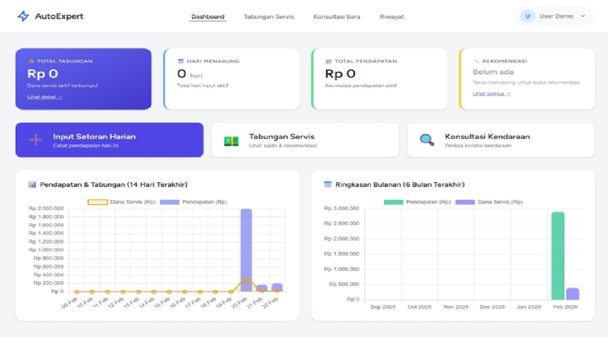
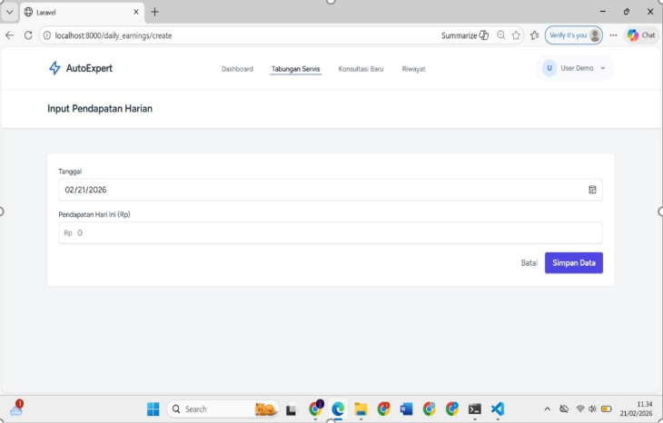
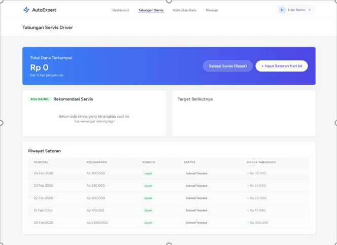

# AutoExpert

**AutoExpert** adalah sistem pendukung keputusan berbasis web yang dirancang untuk membantu pengemudi taksi online dalam mengalokasikan sebagian pendapatan harian sebagai dana servis kendaraan.

Sistem ini menerapkan metode **Forward Chaining** untuk menentukan persentase dana yang perlu dialokasikan berdasarkan jumlah pendapatan harian pengguna.

## 📌 Latar Belakang

Pendapatan pengemudi taksi online dapat berubah-ubah setiap hari. Kondisi tersebut dapat membuat pengelolaan dana untuk kebutuhan servis kendaraan menjadi kurang terencana.

AutoExpert dikembangkan untuk membantu pengguna mengelola dana servis kendaraan dengan cara mencatat pendapatan harian dan secara otomatis menentukan jumlah dana yang perlu disisihkan berdasarkan aturan yang telah ditentukan.

## 🎯 Tujuan

Sistem ini bertujuan untuk:

- Membantu pengguna mencatat pendapatan harian.
- Membantu mengelola dana yang dialokasikan untuk servis kendaraan.
- Menentukan persentase dana servis secara otomatis berdasarkan pendapatan harian.
- Menampilkan perkembangan dana servis melalui dashboard.
- Memberikan rekomendasi terkait kondisi kendaraan melalui fitur konsultasi.
  
## 💡 Project Highlights

Project ini menunjukkan penerapan beberapa konsep dalam pengembangan sistem, antara lain:

- **Decision Support System** untuk membantu menentukan alokasi dana servis kendaraan.
- **Forward Chaining** untuk menentukan persentase dana berdasarkan kondisi pendapatan harian.
- **Rule-Based Decision Making** menggunakan tiga aturan pendapatan (R1, R2, dan R3).
- **CRUD Management** untuk pencatatan pendapatan dan pengelolaan dana servis.
- **Database Management** menggunakan MySQL.
- **Web Application Development** menggunakan Laravel.
- **System Testing** menggunakan 25 sampel data pendapatan harian dengan hasil akurasi perhitungan sebesar 100%.
  
## ⚙️ Cara Kerja Forward Chaining

AutoExpert menerapkan metode **Forward Chaining** untuk menentukan persentase dana yang perlu dialokasikan sebagai dana servis kendaraan berdasarkan pendapatan harian pengguna.

Proses Forward Chaining dimulai dari **fakta yang diketahui**, yaitu jumlah pendapatan harian. Fakta tersebut kemudian dicocokkan dengan kondisi pada aturan yang telah ditentukan. Jika kondisi suatu aturan terpenuhi, sistem menghasilkan kesimpulan berupa persentase dana yang harus dialokasikan untuk servis kendaraan.

### Aturan Sistem

| Rule | Kondisi Pendapatan | Alokasi Dana Servis |
|------|--------------------|---------------------|
| R1 | Pendapatan < Rp150.000 | 15% |
| R2 | Rp150.000 ≤ Pendapatan ≤ Rp250.000 | 10% |
| R3 | Pendapatan > Rp250.000 | 5% |

### Contoh Proses Forward Chaining

Misalnya pengguna memasukkan pendapatan harian sebesar:

**Rp184.000**

Pendapatan tersebut menjadi fakta awal yang diproses oleh sistem:

```text
Fakta:
Pendapatan = Rp184.000
```

Selanjutnya sistem mencocokkan fakta tersebut dengan setiap aturan:

```text
R1 → Rp184.000 < Rp150.000
     Tidak terpenuhi

R2 → Rp150.000 ≤ Rp184.000 ≤ Rp250.000
     Terpenuhi

R3 → Rp184.000 > Rp250.000
     Tidak terpenuhi
```

Karena kondisi pada **Rule R2** terpenuhi, sistem menentukan bahwa persentase dana servis yang dialokasikan adalah **10%**.

Perhitungan dana servis:

```text
Rp184.000 × 10% = Rp18.400
```

Hasil proses:

```text
Pendapatan  : Rp184.000
Rule        : R2
Persentase  : 10%
Dana Servis : Rp18.400
```

Dengan mekanisme tersebut, sistem dapat menentukan alokasi dana servis secara otomatis berdasarkan pendapatan harian pengguna tanpa pengguna harus menentukan persentasenya secara manual.

## 🚀 Fitur Utama

### 1. Dashboard

Menampilkan ringkasan kondisi keuangan pengguna, seperti:

- Total tabungan servis
- Jumlah hari menabung
- Total pendapatan
- Rekomendasi
- Grafik pendapatan dan tabungan

### 2. Input Pendapatan Harian

Pengguna dapat memasukkan pendapatan yang diperoleh setiap hari.

Data tersebut kemudian diproses oleh sistem menggunakan metode Forward Chaining untuk menentukan persentase dana servis.

### 3. Tabungan Servis

Menampilkan:

- Saldo dana servis
- Riwayat setoran
- Pendapatan harian
- Dana yang dialokasikan
- Status dana servis

### 4. Konsultasi Kendaraan

Fitur tambahan yang memungkinkan pengguna memasukkan informasi kendaraan dan memperoleh rekomendasi terkait kondisi kendaraan.

### 5. Riwayat Konsultasi

Pengguna dapat melihat kembali hasil konsultasi kendaraan yang pernah dilakukan.

## 🛠️ Teknologi yang Digunakan

- **Laravel** — Framework pengembangan aplikasi web
- **PHP** — Bahasa pemrograman
- **MySQL** — Database
- **Laragon** — Local development environment
- **Tailwind CSS** — Styling antarmuka
- **Vite** — Asset bundling dan development tool
- **Git & GitHub** — Version control dan repository

## 🗄️ Database

Sistem menggunakan database MySQL untuk menyimpan data pengguna, pendapatan, aturan, serta data konsultasi.

Beberapa tabel utama yang digunakan antara lain:

- `users`
- `pendapatan` / `incomes`
- `rules`
- `konsultasi` / `consultations`

Struktur database digunakan untuk mendukung proses pencatatan pendapatan, perhitungan dana servis, penerapan aturan Forward Chaining, dan penyimpanan hasil konsultasi.

## 🧪 Pengujian

Pengujian sistem dilakukan menggunakan **25 sampel data pendapatan harian** untuk menguji penerapan metode Forward Chaining dan perhitungan dana servis.

| Parameter | Hasil |
|-----------|-------|
| Jumlah Sampel | 25 |
| Eksekusi Rule | Berhasil |
| Perhitungan Dana | Akurat |
| Tingkat Akurasi | 100% |

Berdasarkan hasil pengujian, sistem berhasil mengidentifikasi rule yang sesuai dan menghitung alokasi dana servis berdasarkan aturan yang telah ditentukan.

## 📚 What I Learned

Melalui pengembangan AutoExpert, beberapa hal yang dipelajari antara lain:

- Menerapkan metode **Forward Chaining** dalam sistem berbasis aturan.
- Memahami proses analisis kebutuhan dan perancangan sistem menggunakan pendekatan **Object-Oriented Analysis and Design (OOAD)**.
- Mengembangkan aplikasi web menggunakan **Laravel**.
- Mengelola data menggunakan **MySQL**.
- Membuat proses pencatatan dan pengelolaan data pendapatan secara terstruktur.
- Melakukan pengujian sistem menggunakan metode **Black Box Testing**.
- Menggunakan **Git dan GitHub** untuk version control dan pengelolaan repository.
  
## 📷 Tampilan Sistem

### Dashboard

Dashboard menampilkan ringkasan pendapatan dan dana servis kendaraan pengguna.



### Input Pendapatan Harian

Halaman ini digunakan untuk mencatat pendapatan harian pengguna.



### Tabungan Servis

Halaman ini menampilkan saldo dana servis dan riwayat alokasi dana berdasarkan pendapatan harian.



## 📂 Struktur Project

Project ini dikembangkan menggunakan framework Laravel dengan struktur utama:

```text
AutoExpert/
├── app/
├── bootstrap/
├── config/
├── database/
├── public/
├── resources/
├── routes/
├── storage/
├── tests/
├── artisan
├── composer.json
└── package.json
```

## 🚀 Instalasi

Clone repository:

```bash
git clone https://github.com/mukhwan14/Sistem_rekomendasi_kendaraan.git
cd Sistem_rekomendasi_kendaraan
```

Install dependency:

```bash
composer install
npm install
```

Buat file environment:

```bash
cp .env.example .env
php artisan key:generate
```

Jalankan migrasi database:

```bash
php artisan migrate
```

Jalankan aplikasi:

```bash
php artisan serve
```

Untuk menjalankan Vite:

```bash
npm run dev
```
